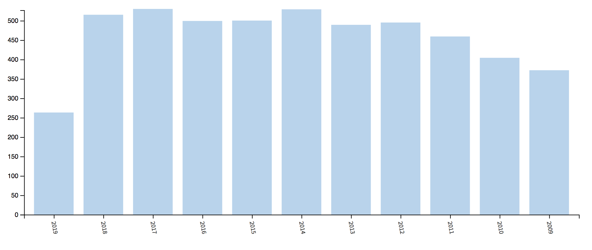
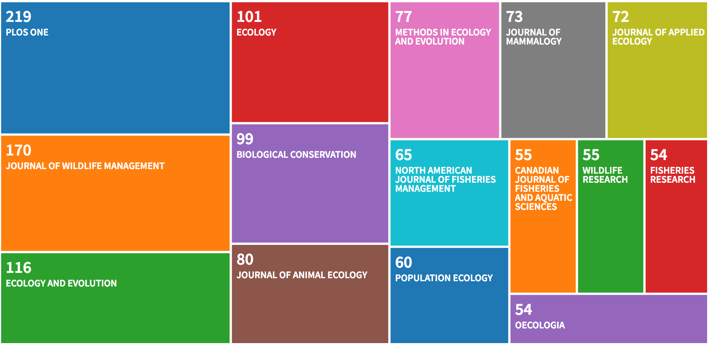
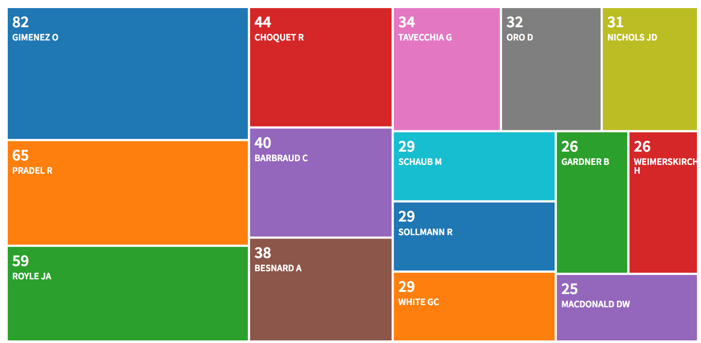

```{r setup, include=FALSE}
knitr::opts_chunk$set(echo = TRUE, 
                      cache = TRUE, 
                      message = FALSE, 
                      warning = FALSE, 
                      dpi = 300, 
                      fig.height=6, 
                      fig.width = 1.777777*6,
                      cache.lazy = FALSE)
library(tidyverse)
theme_set(theme_light())
```

# Introduction

To determine the questions and methods folks have been interested in, we searched for capture-recapture papers in the Web of Science. We found more than 5000 relevant papers during the 2009-2019 period.

To make sense of this big corpus, we carried out bibliometric and textual analyses in the spirit of [Nakagawa et al. 2018](https://www.cell.com/trends/ecology-evolution/fulltext/S0169-5347(18)30278-7). Explanations along with the code and results are in the next section `Quantitative analyses: Bibliometric and textual analyses`. We also inspected a sample of methodological and ecological papers, see section `Qualitative analyses: Making sense of the corpus of scientific papers on capture-recapture`. 

# Quantitative analyses: Bibliometric and textual analyses

## Methods and data collection

To carry out a bibliometric analysis of the capture-recapture literature over the 2009-2019, we used the `R` package [bibliometrix](https://www.bibliometrix.org/). We also carried out a text analysis using topic modelling, for which we recommend the book [Text Mining with R](https://www.tidytextmining.com/).

To collect the data, we used the following settings:

* Data source: Clarivate Analytics Web of Science (<a href="http://apps.webofknowledge.com" class="uri">http://apps.webofknowledge.com</a>)
* Data format: Plain text
* Query: capture-recapture OR mark-recapture OR capture-mark-recapture in Topic (search in title, abstract, author, keywords, and more)
* Timespan: 2009-2019
* Document Type: Articles
* Query data: 5 August, 2019

We load the packages we need:
```{r}
library(bibliometrix) # bib analyses
library(quanteda) # textual data analyses
library(tidyverse) # manipulation and viz data
library(tidytext) # handle text
library(topicmodels) # topic modelling
```

Let us read in and format the data:
```{r}
# Loading txt or bib files into R environment
D <- c("data/savedrecs.txt",
       "data/savedrecs(1).txt",
       "data/savedrecs(2).txt",
       "data/savedrecs(3).txt",
       "data/savedrecs(4).txt",
       "data/savedrecs(5).txt",
       "data/savedrecs(6).txt",
       "data/savedrecs(7).txt",
       "data/savedrecs(8).txt",
       "data/savedrecs(9).txt",
       "data/savedrecs(10).txt")
# Converting the loaded files into a R bibliographic dataframe
# (takes a minute or two)
M <- convert2df(D, dbsource="wos", format="plaintext")
```

We ended up with `r nrow(M)` articles. Note that WoS only allows 500 items to be exported at once, therefore we had to repeat the same operation multiple times. 

We export back as a csv file for further inspection:
```{r eval = TRUE}
M %>% 
  mutate(title = tolower(TI), 
         abstract = tolower(AB),
         authors = AU,
         journal = SO,
         keywords = tolower(DE)) %>%
  select(title, keywords, journal, authors, abstract) %>%
  write_csv("data/crdat.csv")
```

## Descriptive statistics

WoS provides the user with a bunch of graphs, let’s have a look.

Research areas are: 

The number of publications per year is: 

The countries of the first author are: 

The journals are: 

The most productive authors are: 

The graphs for the dataset of citing articles (who uses and what
capture-recapture are used for) show the same patterns as the dataset of
published articles, except for the journals. There are a few different
journals from which a bunch of citations are coming from, namely
Biological Conservation, Scientific Reports, Molecular Ecology and
Proceedings of the Royal Society B - Biological Sciences:


We also want to produce our own descriptive statistics. Let’s have a look to the data with `R`.

Number of papers per journal:
```{r}
dat <- as_tibble(M)
dat %>%
  group_by(SO) %>%
  count() %>%
  filter(n > 50) %>%
  ggplot(aes(n, reorder(SO, n))) +
  geom_col() +
  labs(title = "Nb of papers per journal", x = "", y = "")
```

Most common words in titles:
```{r}
wordft <- dat %>%
  mutate(line = row_number()) %>%
  filter(nchar(TI) > 0) %>%
  unnest_tokens(word, TI) %>%
  anti_join(stop_words) 

wordft %>%
  count(word, sort = TRUE)

wordft %>%
  count(word, sort = TRUE) %>%
  filter(n > 200) %>%
  mutate(word = reorder(word, n)) %>%
  ggplot(aes(n, word)) +
  geom_col() +
  labs(title = "Most common words in titles", x = "", y = "")
```

Most common words in abstracts:
```{r}
wordab <- dat %>%
  mutate(line = row_number()) %>%
  filter(nchar(AB) > 0) %>%
  unnest_tokens(word, AB) %>%
  anti_join(stop_words) 

wordab %>%
  count(word, sort = TRUE)

wordab %>%
  count(word, sort = TRUE) %>%
  filter(n > 1500) %>%
  mutate(word = reorder(word, n)) %>%
  ggplot(aes(n, word)) +
  geom_col() +
  labs(title = "Most common words in abstracts", x = "", y = "")
```

## Bibliometric results

Now we turn to a more detailed analysis of the published articles. 

First calculate the main bibliometric measures:
```{r}
results <- biblioAnalysis(M, sep = ";")
options(width=100)
S <- summary(object = results, k = 10, pause = FALSE)
```

Visualize:
```{r}
plot(x = results, k = 10, pause = FALSE)
```

The 100 most frequent cited manuscripts:
```{r}
CR <- citations(M, field = "article", sep = ";")
cbind(CR$Cited[1:100])
```

The most frequent cited first authors:
```{r}
CR <- citations(M, field = "author", sep = ";")
cbind(CR$Cited[1:25])
```

Top authors productivity over time:
```{r}
topAU <- authorProdOverTime(M, k = 10, graph = TRUE)
```

## Network results

Below is an author collaboration network, where nodes represent top 30 authors in terms of the numbers of authored
papers in our dataset; links are co-authorships. The Louvain algorithm is used throughout for clustering:
```{r}
M <- metaTagExtraction(M, Field = "AU_CO", sep = ";")
NetMatrix <- biblioNetwork(M, analysis = "collaboration", network = "authors", sep = ";")
net <- networkPlot(NetMatrix, n = 30, Title = "Collaboration network", type = "fruchterman", 
                   size = TRUE, remove.multiple = FALSE, labelsize = 0.7, cluster = "louvain")
```

Country collaborations:
```{r}
NetMatrix <- biblioNetwork(M, analysis = "collaboration", network = "countries", sep = ";")
net <- networkPlot(NetMatrix, n = 20, Title = "Country collaborations", type = "fruchterman", 
                   size = TRUE, remove.multiple = FALSE, labelsize = 0.7, cluster = "louvain")
```

A keyword co-occurrences network:
```{r}
NetMatrix <- biblioNetwork(M, analysis = "co-occurrences", network = "keywords", sep = ";")
netstat <- networkStat(NetMatrix)
summary(netstat, k = 10)
net <- networkPlot(NetMatrix, normalize = "association", weighted = T, n = 50, 
                   Title = "Keyword co-occurrences", type = "fruchterman", size = T,
                   edgesize = 5, labelsize = 0.7)
```

## Textual analysis: Topic modelling on abstracts

To know everything about textual analysis and topic modelling in particular, we recommend the reading of [Text Mining with R](https://www.tidytextmining.com/).

Clean and format the data:
```{r}
wordfabs <- dat %>%
  mutate(line = row_number()) %>%
  filter(nchar(AB) > 0) %>%
  unnest_tokens(word, AB) %>%
  anti_join(stop_words) %>%
  filter(str_detect(word, "[^\\d]")) %>%
  group_by(word) %>%
  mutate(word_total = n()) %>%
  ungroup() 

desc_dtm <- wordfabs %>%
  count(line, word, sort = TRUE) %>%
  ungroup() %>%
  cast_dtm(line, word, n)
```

Perform the analysis, takes several minutes:
```{r eval = TRUE}
desc_lda <- LDA(desc_dtm, k = 20, control = list(seed = 42))
tidy_lda <- tidy(desc_lda)
```

Visualise results:
```{r eval = TRUE}
top_terms <- tidy_lda %>%
  filter(topic < 13) %>%
  group_by(topic) %>%
  top_n(10, beta) %>%
  ungroup() %>%
  arrange(topic, -beta)

top_terms %>%
  mutate(term = reorder(term, beta)) %>%
  group_by(topic, term) %>%    
  arrange(desc(beta)) %>%  
  ungroup() %>%
  mutate(term = factor(paste(term, topic, sep = "__"), 
                       levels = rev(paste(term, topic, sep = "__")))) %>%
  ggplot(aes(term, beta, fill = as.factor(topic))) +
  geom_col(show.legend = FALSE) +
  coord_flip() +
  scale_x_discrete(labels = function(x) gsub("__.+$", "", x)) +
  labs(title = "Top 10 terms in each LDA topic",
       x = NULL, y = expression(beta)) +
  facet_wrap(~ topic, ncol = 4, scales = "free")

ggsave('figs/topic_abstracts.png', width = 12, dpi = 600)
```

This is quite informative! Topics can fairly easily be interpreted: 1 is about estimating fish survival, 2 is about photo-id, 3 is general about modeling and estimation, 4 is disease ecology, 5 is about estimating abundance of marine mammals, 6 is about capture-recapture in (human) health sciences, 7 is about the conservation of large carnivores (tigers, leopards), 8 is about growth and recruitment, 9 about prevalence estimation in humans, 10 is about the estimation of individual growth in fish, 11 is (not a surprise) about birds (migration and reproduction), and 12 is about habitat perturbations.

# Qualitative analyses: Making sense of the corpus

## Motivation

Our objective was to make a list of ecological questions and methods that
were addressed in these papers. The bibliometric and text analyses above were useful, but we needed to
dig a bit deeper to achieve the objective. Here how we did.

## Methodological papers

First, we isolated the methodological journals. To do so, we focused the
search on journals that had published more than 10 papers about
capture-recapture over the last 10 years:
```{r}
raw_dat <- read_csv(file = 'data/crdat.csv')
raw_dat %>% 
  group_by(journal) %>%
  filter(n() > 10) %>%
  ungroup() %>%
  count(journal)
```

By inspecting this list, we ended up with these methodological journals:
```{r}
methods <- raw_dat %>% 
  filter(journal %in% c('BIOMETRICS',
                        'ECOLOGICAL MODELLING',
                        'JOURNAL OF AGRICULTURAL BIOLOGICAL AND ENVIRONMENTAL STATISTICS',
                        'METHODS IN ECOLOGY AND EVOLUTION',
                        'ANNALS OF APPLIED STATISTICS',
                        'ENVIRONMENTAL AND ECOLOGICAL STATISTICS'))

methods %>%
  count(journal, sort = TRUE)
```

Now we exported the 219 papers published in these methodological journals in a csv file:
```{r}
raw_dat %>% 
  filter(journal %in% c('BIOMETRICS',
                        'ECOLOGICAL MODELLING',
                        'JOURNAL OF AGRICULTURAL BIOLOGICAL AND ENVIRONMENTAL STATISTICS',
                        'METHODS IN ECOLOGY AND EVOLUTION',
                        'ANNALS OF APPLIED STATISTICS',
                        'ENVIRONMENTAL AND ECOLOGICAL STATISTICS')) %>%
  write_csv('data/papers_in_methodological_journals.csv')
```

The next step was to annotate this file to determine the methods used. `R` could not help, and we had to do it by hand. We read the >200 titles and abstracts and added our tags in an extra column. The task was cumbersome but very interesting. We enjoyed seeing what colleagues have been working on. The results are in [this file](data/papers_in_methodological_journals_annotated.csv).

By focusing the annotation on the methodological journals, we ignored all the methodological papers that had been published in other non-methodological journals like, among others, Ecology, Journal of Applied Ecology, Conservation Biology and Plos One which welcome methods. We address this issue below. In brief, we scanned the corpus of ecological papers and tagged all methodological papers (126 in total); we added them to the [file of methodological papers](data/papers_in_methodological_journals_annotated.csv) and added a column to keep track of the paper original (methodological vs ecological corpus).

## Ecological papers

Second, we isolated the ecological journals. To do so, we focused the search
on journals that had been published more than 50 papers about
capture-recapture over the last 10 years, and we excluded the
methodological journals:
```{r}
ecol <- raw_dat %>% 
  filter(!journal %in% c('BIOMETRICS',
                        'ECOLOGICAL MODELLING',
                        'JOURNAL OF AGRICULTURAL BIOLOGICAL AND ENVIRONMENTAL STATISTICS',
                        'METHODS IN ECOLOGY AND EVOLUTION',
                        'ANNALS OF APPLIED STATISTICS',
                        'ENVIRONMENTAL AND ECOLOGICAL STATISTICS')) %>%
  group_by(journal) %>%
  filter(n() > 50) %>%
  ungroup()

ecol %>% 
  count(journal, sort = TRUE)

ecol %>%
  nrow()

ecol %>%
  write_csv('data/papers_in_ecological_journals.csv')
```

Again, we inspected the papers one by one. We mainly focused the reading on the titles and abstracts. We did not annotate the papers.

# Note

This work initially started as a talk we gave at the Wildlife Research and Conservation 2019 conference in Berlin. The slides can be downloaded [here](https://github.com/oliviergimenez/capture-recapture-review/blob/master/talkGimenez.pdf). There is also a video recording of the talk [there](https://drive.google.com/open?id=1RFQ3Dr6vVii4J5-8hMlPW81364JYG6CP), and a [Twitter thread](https://twitter.com/oaggimenez/status/1178044240036876289) of it. We also presented a poster at the Euring 2021 conference, see [here](https://github.com/oliviergimenez/posterEuring2021).

# `R` version used

```{r}
sessionInfo()
```
